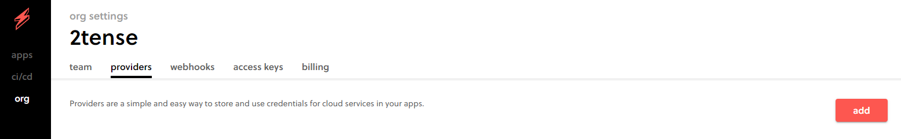
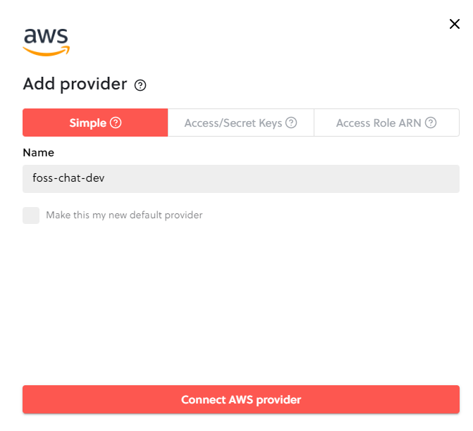
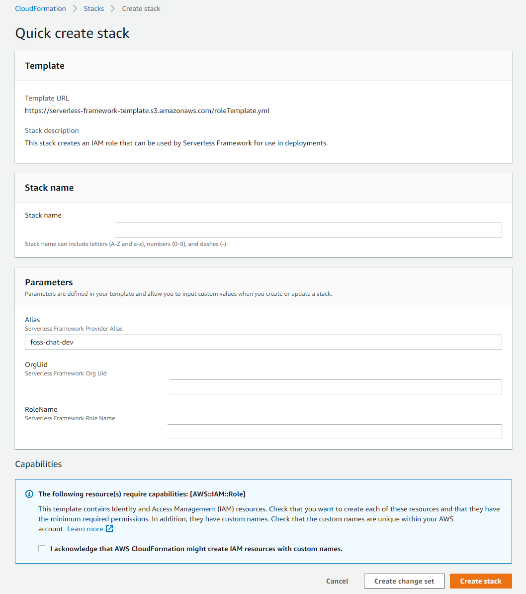
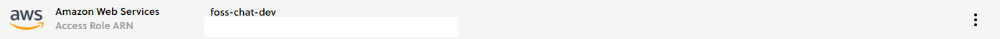
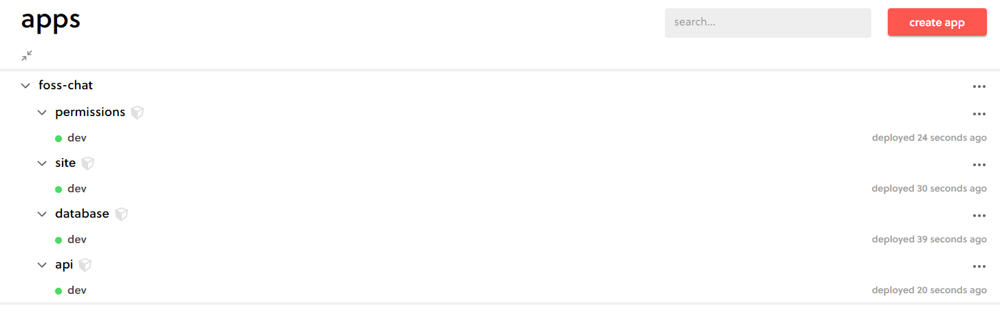
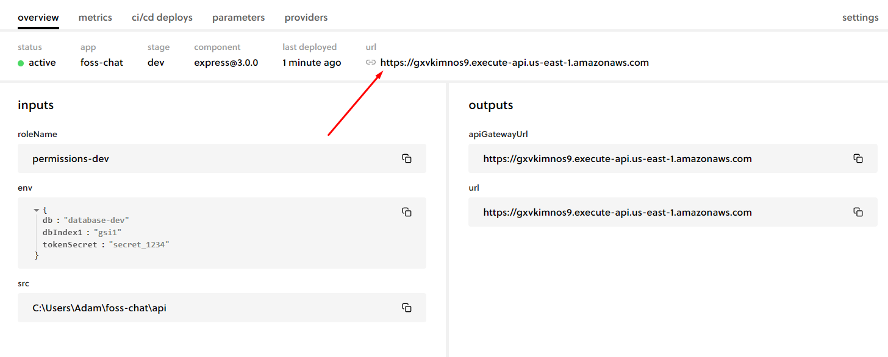

# foss-chat

## Quickstart Guide

The `foss-chat` platform utilizes the [serverless](https://github.com/serverless/serverless) framework to manage 
application deployment.  Developers and Users are encouraged to create an account on the 
[Serverless Dashboard](https://app.serverless.com/) to manage their AWS credentials, development environments,
and CD/CI workflows for automated production deployments.

There are alternate methods to [manage providers](https://www.serverless.com/framework/docs/providers), however this 
guide will cover using the Serverless Dashboard with AWS. 

### Create a Development Instance

#### Create a Serverless Provider

A serverless provider is a set of credentials for a cloud service.  Best practices indicate one should create a separate 
provider for each application, including your development environment.

* From the [Serverless Dashboard](https://app.serverless.com/) dashboard, navigate to `org`, then select the `providers` tab, then click `add` to add a new 
provider.

* Select "Simple", name the provider `foss-chat-dev` (or similar), then click `Connect AWS Provider`

* Log in with your AWS credentials, check the `Acknowledge` box, then `Create Stack`

* Return to the Serverless Dashboard tab.  You should now have the `foss-chat-dev` provider

#### Install Serverless Framework

* Install [Node](https://nodejs.org/en/download/package-manager/) on your system
* Install the serverless framework by executing `npm install -g serverless` from the command line
* Log in to the Serverless Dashboard by executing ``

#### Deploy the Cloud Platform

* Execute `serverless deploy`
* Navigate to the Serverless Dashboard.  Notice the `dev` stage of the platform services are running.

* Click on `api->dev`, notice the API URL has been generated here.

#### Start a Local Instance of the Frontend

* Open `.../site/src/config.js` and set the `config.domains.api` variable to your cloud api devopment URL from above
* Start the application using `npm start` (TODO: replace this with whatever's appropriate for Vue.js)

### Destroy your Development Instance

Destroy the development instance by executing `serverless remove`.

### Create a Production Deployment

**TBD**
